```{r setup, include=FALSE}
knitr::opts_chunk$set(echo = FALSE)
```

# 1.0  Critiques of Existing Visualisation with Suggested Improvements

```{r, echo=FALSE, echo=FALSE, message=FALSE}

knitr::include_graphics("images/Fig1_ExistingViz.png")
```

### Clarity

|S/N| Comments | Suggested Improvement |
|:-:| :------------------------------- | :------------------------------- |
| 1 | Lead-in paragraph is informative and discusses about both the change in the Labour Force Participation Rate (LFPR) and in the share of the resident labour force by age groups from 2009 to 2019. However, the current chart only shows the share of the resident labour force by age groups. No data is shown to depict the change in the LFPR, which might confuse the readers on the data being referenced in the analysis. | Include another additional chart that shows the corresponding LFPR by age bands for 2009 and 2019 |
| 2 | Lead-in paragraph cites the percentages as the sum of broader age bands (e.g. aged 25 to 54 instead of the 5-year age band of 25-29, 30-34 to 50-54) making it difficult for the readers to relate the figures with the chart directly.| Annotate within the chart the total percentages across the age bands that were being mentioned in the lead-in paragraph so that readers can easily identify how the percentages cited were derived |
| 3 | Title of the existing chart might be confusing as “Resident labour force by age” might be interpreted as the actual number of residents that are in the labour force for each age band but the current unit for the chart is in percent. | Revise the chart title to “Share of Resident Labour Force by Age” to reflect that the figures shown are percentages and total across all age groups will sum to 100% |
| 4 | Data are being represented in age bands on the x-axis. Using line chart makes it difficult for readers to identify the corresponding points for age group on the x-axis. Also, the use of line chart might mislead the reader to interpret the data as being time-series data. Line charts are not advisable to be used for comparison of categorical data. | Revise the chart to represent each age band as a bar chart (horizontal/ vertical) to clearly show that age is being charted as discrete categorical bands instead of continuous age value |
| 5 | While having the reference line for the median age is useful for comparing between the 2 years, charting it on the x-axis which is shown in terms of age bands is confusing. | Keep the median age comparison but as a separate chart instead of reference levels |

### Aesthetics

|S/N| Comments | Suggested Improvement |
|:-:| :------------------------------- | :------------------------------- |
| 6 | Choice of font, font size and layout is generally clear with the title of the chart at the top left corner of the chart. Labels on x-axis are clearly displayed horizontally. | Can keep to the existing font, font size and layout |
| 7 | The use of colour coding (grey for 2009 and blue for 2019) helps readers to easily distinguish the data between the 2 years. The more recent year of 2019 also stands out since the blue colour used is brighter. | Two distinct colours can still be used for each year to distinguish between them |
| 8 | There is currently no y-axis and no indication of the data units being shown in the line chart. It might not be clear to the readers what data are being represented by the 2 lines in the chart. | Add the necessary labelling for the axis to allow readers to clearly identify the data that is being charted |


# 2.0  Ways to Improve Current Visualisation

### Sketch of Proposed Design

```{r, echo=FALSE, message=FALSE}

knitr::include_graphics("images/Fig2_Sketch.jpg")
```

- The usage of bar charts instead of line charts can better represent the data which was grouped into categorical age bands. Presentation of the data in sequential age bands of around 5 years was kept which allows readers to see the differences across the age groups on a more detailed level.
-	Addition of the chart on the Labour Force Participation Rate (LFPR) as well as the net percentages across age bands for the share of Labour Force allows for consistency in the information described in the lead-in paragraph and the charts, where readers can easily identify the source of the data in the visualisation.
-	Having the two charts with the corresponding age bands side-by-side allows the readers to easily see how the share and the LFPR has changed for each age band and compare across the age bands.
-	Separating the median age from the chart also prevents confusion since the age data was not being shown as a continuous variable.


# 3.0  Step-by-step Description on Preparation

|S/N| Interface | Step | Action |
|:-:| :----- | :----- | :-------------------------------------------------------- |
| 1 | Excel Tables | Data preparation - Extract relevant data and format into proper structure | Perform the following steps for Table 5 and Table 7: <br> • Extract data from the Total tab, keeping only column data for 2009 and 2019 as well as row data for the header and the individual age bands (i.e. rows 5, 7 to 18) <br> • Format the structure to remove all the leading empty rows (i.e. header to start at row 1) and all the empty columns so that the data is in the correct format for importing into Tableau <br> 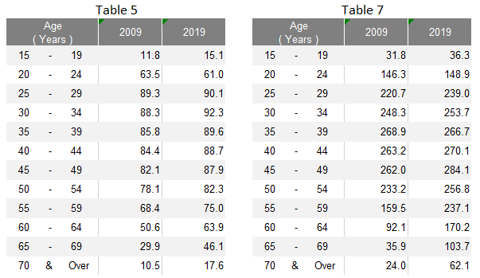{width=90%} <br> Save the extracted data into a new excel file with one table on each worksheet tab |
| 2 | Excel Tables | Data preparation - Format row labels | Remove the extra white spaces in the age labels (e.g. from “15      -      19” to “15 - 19") |
| 3 | Data Source | Import data into Tableau | • Under Connect to a File, click Microsoft Excel and select the relevant excel file from the correct directory <br> • Relate Table 5 and Table 7 using the common variable of Age (Years) <br> 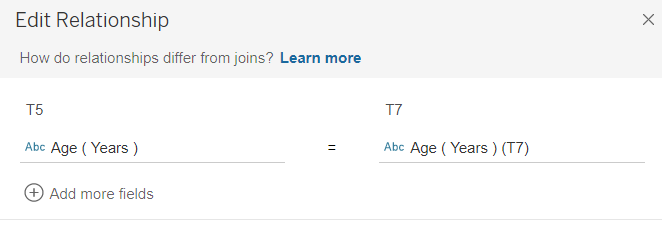{width=80%} |
| 4 | Sheet 1 (LF_Share) | Create pyramid chart for Share of Resident Labour Force by Age | Drag T7 Age under Rows, T7 2009 and T7 2019 under Columns <br> 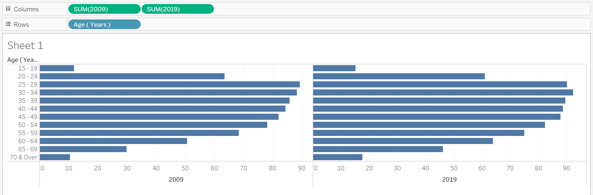{width=90%} |
| 5 | Sheet 1 (LF_Share) | Convert the measures into percent | Use quick table calculations and convert both T7 2009 and T7 2019 to percent of total (i.e. value shown in the original chart) |
| 6 | Sheet 1 (LF_Share) | Format the charts | • Edit the x-axis of the 2009 chart and select “Reversed” to reverse the axis of the chart on the left <br> 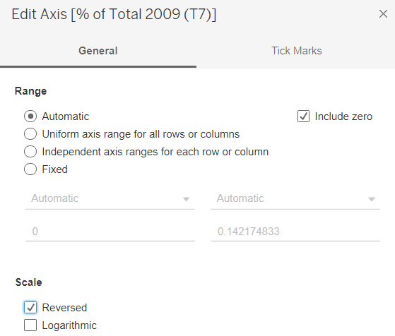{width=80%} <br> • Click on Label and select “Show marks labels” to add the chart labels for both 2009 and 2019 charts <br> • Format the measures to display them to 1 decimal place by changing the “Numbers” under Default section of the Pane tab to Percentages 1 decimal place <br> • Right click on the x-axis and select Edit Axis. Fix the range to have a consistent range for both left and right charts <br> • Colour code the 2 charts into 2 different colours by year using the Colour button under the Marks cart <br> • Remove the vertical gridlines under Format Lines by changing the “Grid Lines” of the Column tab to None <br> • Edit the Tooltip under the Marks cart for the label of the % to “% out of Total in [YYYY]” <br> 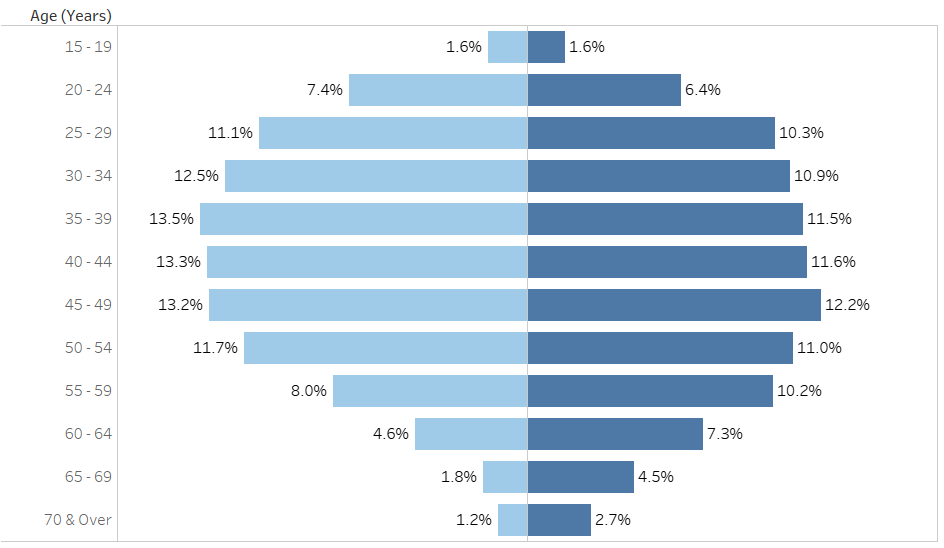{width=90%} |
| 7 | Sheet 1 (LF_Share) | Format the charts – Add the x-axis at the top of the chart | •	Drag another T7 2009 (after the current T7 2009) and T7 2019 (after the current T7 2019) under Columns <br> • Change the chart type back to Bar for all charts <br> • Use quick table calculations and convert the new T7 2009 and T7 2019 to percent of total <br> • For each of the new measure added, click on the arrow and select “Dual Axis” to merge the charts of the same measure as one <br> 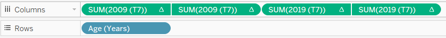{width=80%} <br> • Change the colour of the charts for the two new measures to Opacity = 0% under their corresponding Marks cart <br> • Right click on the x-axis at the top and select “Synchronize Axis” <br> • “Remove” the bottom x-axis for both charts by selecting Edit Axis then clear the Title text box under Titles and select None for both Major tick marks and Minor tick marks under the Tick Marks tab <br> • Change the top x-axis to show only the label of “% in June [YYYY]” by selecting Edit Axis then revise the Title text box under Titles and select None for both Major tick marks and Minor tick marks under the Tick Marks tab |
| 8 | Sheet 1 (LF_Share) | Add chart title | Title of the chart was changed to “Share of Resident Labour Force by Age” with the unit of Per cent added below by clicking on the Title to edit |
| 9 | Data Source | Transform data into required format | • Pivot the columns T5 2009 and T5 2019 <br> • Rename “Pivot Field Names” to “Year”, “Pivot Field Values” to “LFPR” |
| 10 | Sheet 2 (LFPR) | Create dumbbell chart for LFPR by Age | • Drag T5 Age under Rows, LFPR under Columns and Year under Colour <br> • Change the mark type from Automatic to Circle <br> 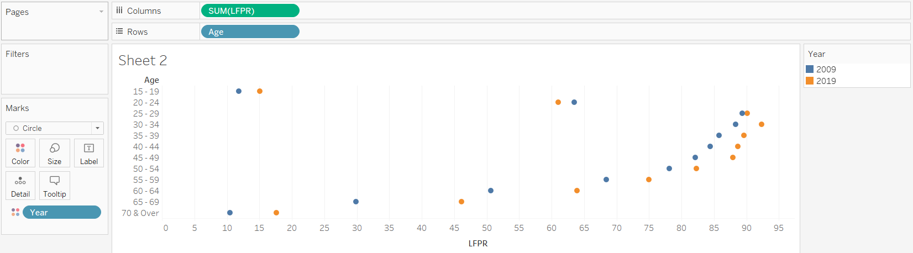{width=95%} <br> • Drag another LFPR under Columns and change the mark type to Line <br> • Remove Year from Colour and drag it to Path <br> 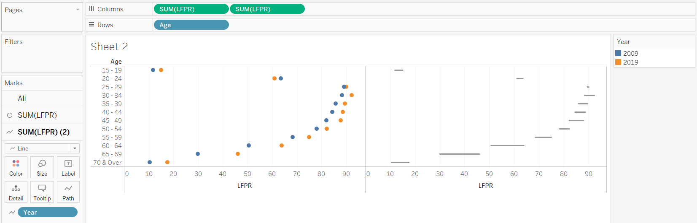{width=95%} |
| 11 | Sheet 2 (LFPR) | Format the chart | • Right click on the second pill of LFPR and select “Dual Axis” <br> • Right click on one of the x-axis and select “Synchronise Axis” <br> • Swop the order of the two LFPR pills such that the line appears behind the dots <br> • Rename the bottom x-axis to “% LFPR” <br> • Hide the top x-axis by right clicking the x-axis and unselecting “Show Header” <br> • Colour code the dots for the 2 years into the 2 corresponding colours used in the previous chart in Sheet 1 <br> • Increase the size of the dots and the thickness of the line <br> 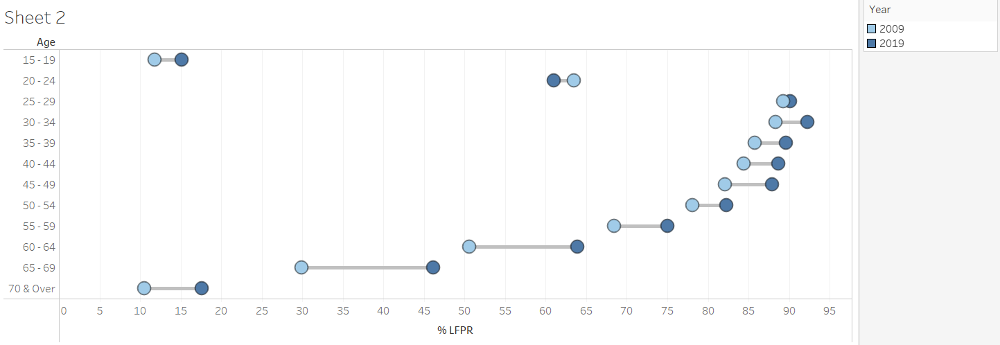{width=95%} |
| 12 | Sheet 2 (LFPR) | Add Chart Title | Title of the chart was changed to “Resident Labour Force Participation Rate by Age” with the unit of Per cent added below by clicking on the Title to edit |
| 13 | Sheet 3 (LF_Nett) | Create new calculated field with recoded age bands | Recode the age into broader age bands using “Create Calculated Fields…” and input the details below <br> 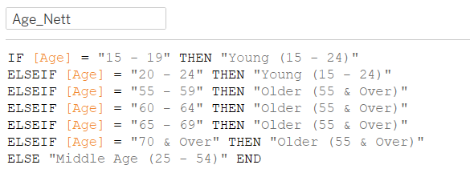{width=80%} |
| 14 | Sheet 3 (LF_Nett) | Create table with Share of Resident Labour Force by broader age bands | • Drag Age_Nett under Rows, Measure Names under Columns and Measure Values under Text <br> • Remove the irrelevant measures under Measure Values to keep only T7 2009 and T7 2019 <br> • Use quick table calculations and convert both T7 2009 and T7 2019 under Measure Values to percent of total |
| 15 | Sheet 3 (LF_Nett) | Format the table | •	Right click on the header and unselect “Show Header” <br> • Right click on the header of the rows and select “Hide Field Labels for Rows” <br> • Click on the arrow for each measure under Measure Values and format to display them to 1 decimal place by changing the “Numbers” under Default section of the Pane tab to Percentages 1 decimal place <br> • Right click on the table and add table border under the Format Border <br> • Rearrange the rows in ascending age order by dragging the rows to the correct position |
| 16 | Dashboard | Create the Dashboard, Add Title and Format | • Create a new dashboard sheet. Drag LF_Share and LFPR from the Sheets cart into the dashboard sheet to be displayed side by side. Drag LF_Nett under the LF_Share chart <br> • Select “Show Title” under Dashboard. Title of the dashboard was changed to “Increase in older residents in the labour force from 2009 to 2019”, with the year colour coded <br> • Add in a text box under the Title to add in the lead-in paragraph |
| 17 | Dashboard | Format the Legend | • Rearrange the legend to display it under the LFPR chart <br> • Right click on each legend and click “Edit Alias” to rename each legend label to “June [YYYY]” <br> • Click more options on the left of the Legend, select “Arrange items” and Single Row <br> 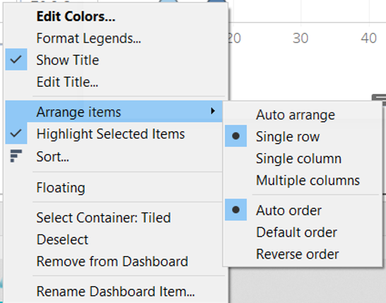{width=80%} <br> • Add a Blank to the left of the Legend to right align the Legend relative to the LFPR chart |
| 18 | Dashboard | Add in the median ages | • Add in the median ages for 2009 and 2019 with the label of Median Age as separate text boxes under the LFPR_Nett table <br> • Colour code the median ages by the year |
| 19 | Data Source | Publish onto Tableau Public | Convert the connection from Live to Extract to allow publishing to Tableau Public <br> 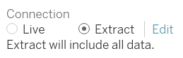{width=60%} |


# 4.0  Final Data Visualisation Output

```{r, echo=FALSE, message=FALSE, layout="l-body-outset"}

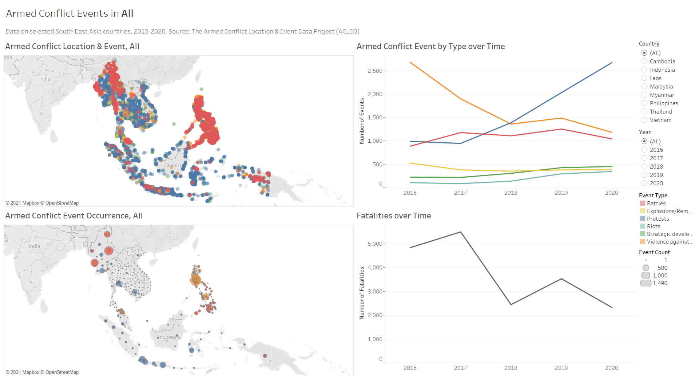
```

**Link to Tableau Dashboard:** https://public.tableau.com/profile/selenechoong#!/vizhome/ISSS608_DataViz_Makeover_01/Dashboard


# 5.0  Major Observations

**Observation 1:** <br>
Between 2009 to 2019, share of the middle-aged residents (aged 25 - 54) among the resident labour force has declined (75.3% in 2009 to 67.4% in 2019), despite the increase in Labour Force Participation Rate (LFPR) among these middle-aged residents.

```{r, echo=FALSE, message=FALSE, out.width="70%"}

knitr::include_graphics("images/Obs1_MiddleAged.jpg")
```

**Observation 2:** <br>
While LFPR remained lower among older residents (aged 55 & over) as compared to the middle-aged residents (aged 25 - 54) in 2019, there was a larger increase in LFPR  observed among these older residents between 2009 to 2019, particularly among those aged 60 to 69 with more than 10% point increase.

```{r, echo=FALSE, message=FALSE, out.width="70%"}

knitr::include_graphics("images/Obs2_LFPR.jpg")
```

**Observation 3:** <br>
All age bands experienced a rise in the LFPR between 2009 to 2019, except for residents aged 20 to 24 where LFPR has declined from 63.5% to 61.0%. 

```{r, echo=FALSE, message=FALSE, out.width="70%"}

knitr::include_graphics("images/Obs3_20-24.jpg")
```

**Observation 4:** <br>
Distribution of the resident labour force used to be more right skewed in 2009 (i.e. younger labour force) as compared to 2019, where the distribution of the resident labour force appears to be more symmetric. This is further supported by the increase in median age of the residents in the labour force.

```{r, echo=FALSE, message=FALSE, out.width="70%"}

knitr::include_graphics("images/Obs4_distribution.jpg")
```