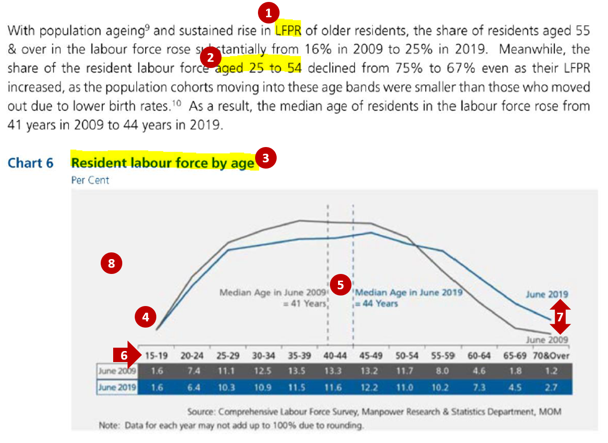
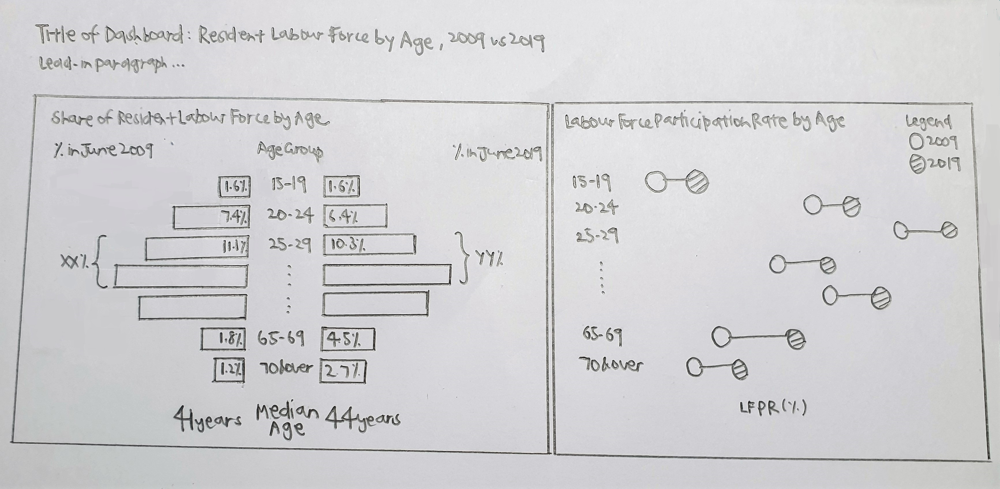
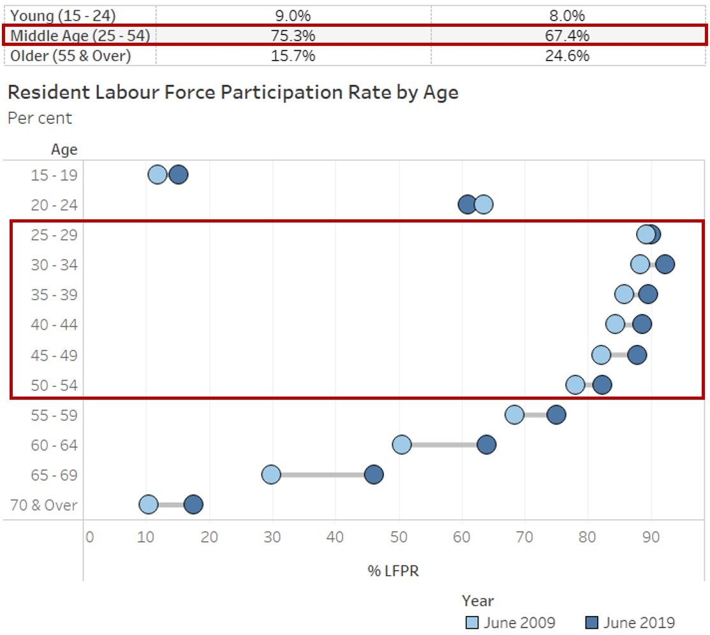
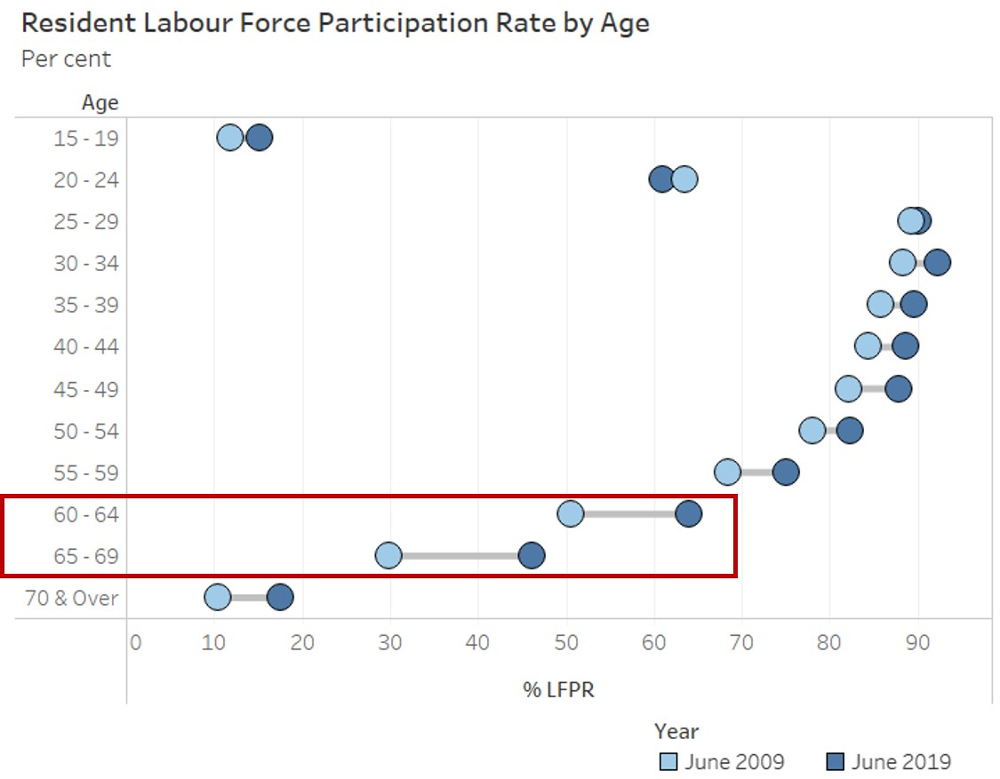
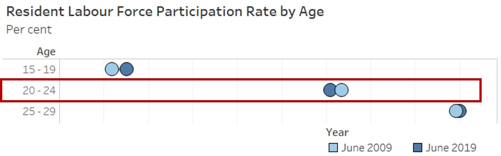
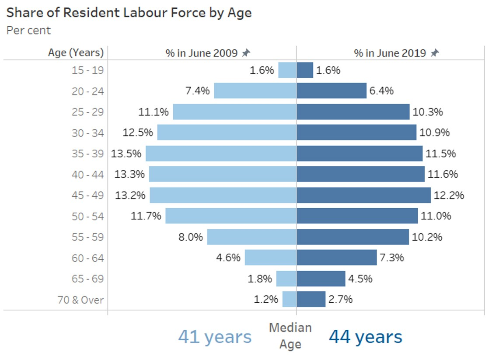

```{r setup, include=FALSE}
knitr::opts_chunk$set(echo = FALSE)
```

# 1.0 Critiques of Existing Visualisation with Suggested Improvements

```{r, echo=FALSE, echo=FALSE, message=FALSE}

library(knitr)

```

### Clarity

|S/N| Comments | Suggested Improvement |
|:-:| :------------------------------- | :------------------------------- |
| 1 | Lead-in paragraph is informative and discusses about both the change in the Labour Force Participation Rate (LFPR) and in the share of the resident labour force by age groups from 2009 to 2019. However, the current chart only shows the share of the resident labour force by age groups. No data is shown to depict the change in the LFPR, which might confuse the readers on the data being referenced in the analysis. | Include another additional chart that shows the corresponding LFPR by age bands for 2009 and 2019 |
| 2 | Lead-in paragraph cites the percentages as the sum of broader age bands (e.g. aged 25 to 54 instead of the 5-year age band of 25-29, 30-34 to 50-54) making it difficult for the readers to relate the figures with the chart directly.| Annotate within the chart the total percentages across the age bands that were being mentioned in the lead-in paragraph so that readers can easily identify how the percentages cited were derived |
| 3 | Title of the existing chart might be confusing as “Resident labour force by age” might be interpreted as the actual number of residents that are in the labour force for each age band but the current unit for the chart is in percent. | Revise the chart title to “Share of Resident Labour Force by Age” to reflect that the figures shown are percentages and total across all age groups will sum to 100% |
| 4 | Data are being represented in age bands on the x-axis. Using line chart makes it difficult for readers to identify the corresponding points for age group on the x-axis. Also, the use of line chart might mislead the reader to interpret the data as being time-series data. Line charts are not advisable to be used for comparison of categorical data. | Revise the chart to represent each age band as a bar chart (horizontal/ vertical) to clearly show that age is being charted as discrete categorical bands instead of continuous age value |
| 5 | While having the reference line for the median age is useful for comparing between the 2 years, charting it on the x-axis which is shown in terms of age bands is confusing. | Keep the median age comparison but as a separate chart instead of reference levels |

### Aesthetics

|S/N| Comments | Suggested Improvement |
|:-:| :------------------------------- | :------------------------------- |
| 6 | Choice of font, font size and layout is generally clear with the title of the chart at the top left corner of the chart. Labels on x-axis are clearly displayed horizontally. | Can keep to the existing font, font size and layout |
| 7 | The use of colour coding (grey for 2009 and blue for 2019) helps readers to easily distinguish the data between the 2 years. The more recent year of 2019 also stands out since the blue colour used is brighter. | Two distinct colours can still be used for each year to distinguish between them |
| 8 | There is currently no y-axis and no indication of the data units being shown in the line chart. It might not be clear to the readers what data are being represented by the 2 lines in the chart. | Add the necessary labelling for the axis to allow readers to clearly identify the data that is being charted |


# 2.0 Ways to Improve Current Visualisation

### Sketch of Proposed Design

```{r, echo=FALSE, message=FALSE}

library(knitr)

```

- The usage of bar charts instead of line charts can better represent the data which was grouped into categorical age bands. Presentation of the data in sequential age bands of around 5 years was kept which allows readers to see the differences across the age groups on a more detailed level.
-	Addition of the chart on the Labour Force Participation Rate (LFPR) as well as the netted percentages across age bands allows for consistency in the information described in the lead-in paragraph and the charts, where readers can easily identify the source of the data in the visualisation.
-	Having the two charts with the corresponding age bands side-by-side allows the readers to easily see how the share and the LFPR has changed for each age band and compare across the age bands.
-	Separating the median age from the chart also prevents confusion since the age data was not being shown as a continuous variable.


# 3.0 Step-by-step Description on Preparation


**Link to Tableau Dashboard:** https://public.tableau.com/profile/selenechoong#!/vizhome/ISSS608_DataViz_Makeover_01/Dashboard

# 4.0 Major Observations

**Observation 1:** <br>
Between 2009 to 2019, share of the middle-aged residents (aged 25 - 54) among the resident labour force has declined (75.3% in 2009 to 67.4% in 2019), despite the increase in Labour Force Participation Rate (LFPR) among these middle-aged residents.

```{r, echo=FALSE, message=FALSE, out.width="70%"}


```

**Observation 2:** <br>
While LFPR remained lower among older residents (aged 55 & over) as compared to the middle-aged residents (aged 25 - 54) in 2019, there was a larger increase in LFPR  observed among these older residents between 2009 to 2019, particularly among those aged 60 to 69 with more than 10% point increase.

```{r, echo=FALSE, message=FALSE, out.width="70%"}


```

**Observation 3:** <br>
All age bands experienced a rise in the LFPR between 2009 to 2019, except for residents aged 20 to 24 where LFPR has declined from 63.5% to 61.0%. 

```{r, echo=FALSE, message=FALSE, out.width="70%"}


```

**Observation 4:** <br>
Distribution of the resident labour force used to be more right skewed in 2009 (i.e. younger labour force) as compared to 2019, where the distribution of the resident labour force appears to be more symmetric. This is further supported by the increase in median age of the residents in the labour force.

```{r, echo=FALSE, message=FALSE, out.width="70%"}


```