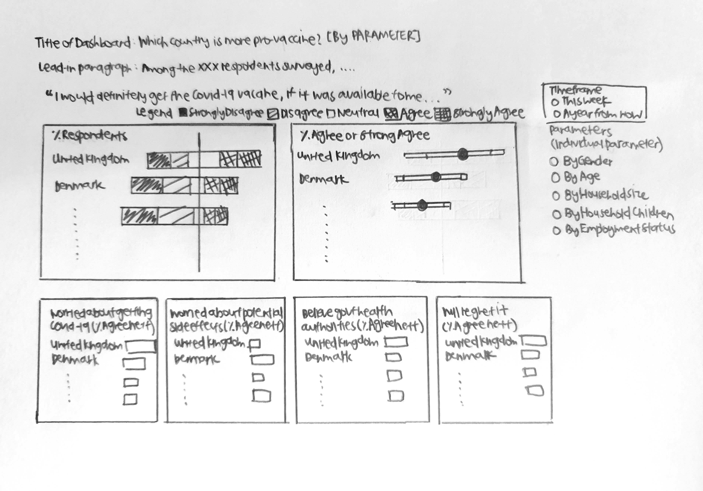
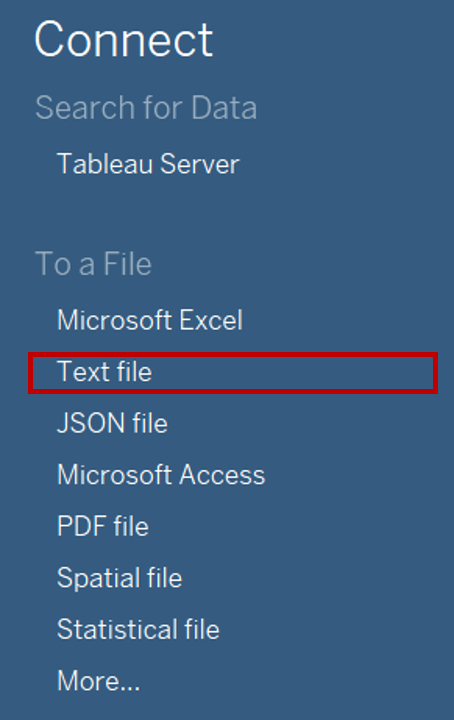
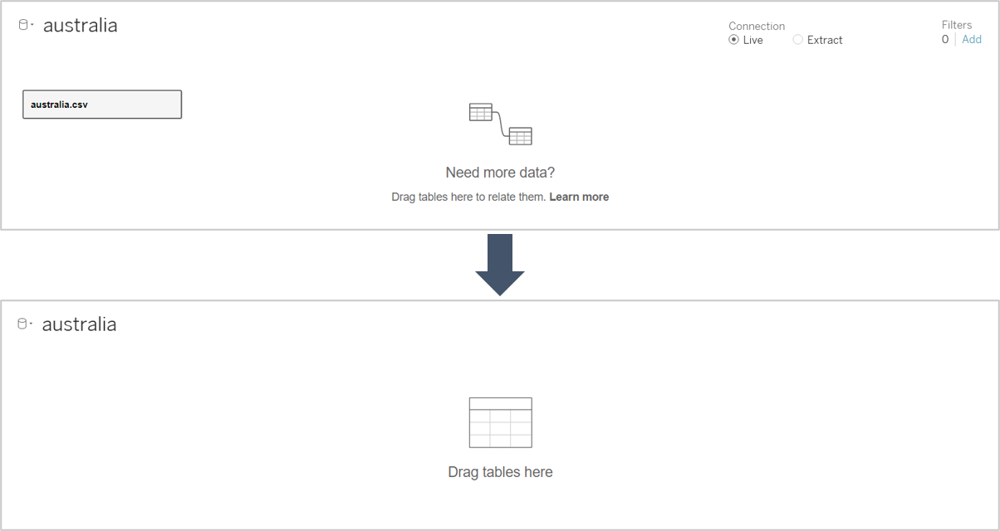
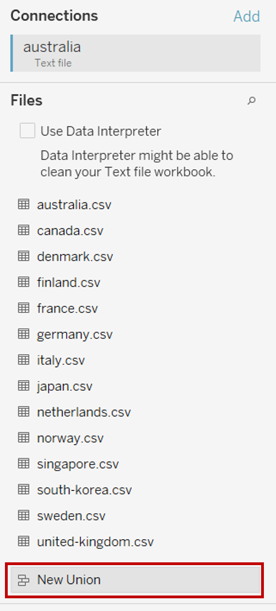
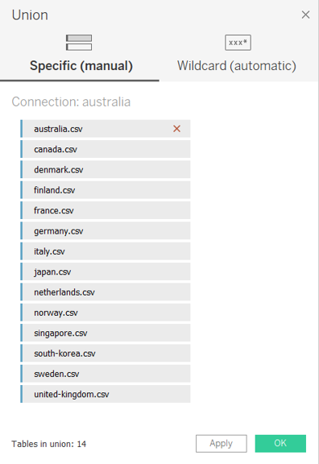
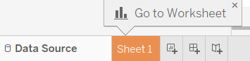
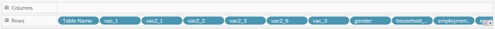
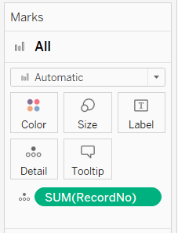
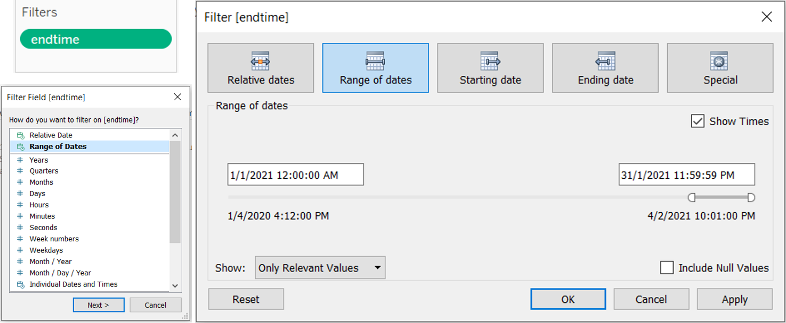
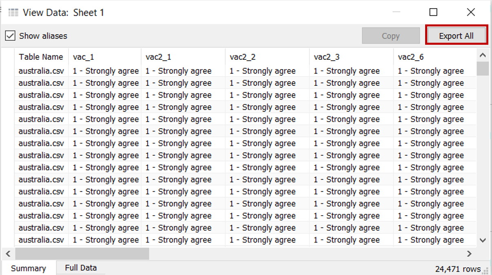

```{r setup, include=FALSE}
knitr::opts_chunk$set(echo = FALSE)
```

# 1.0  Critiques of Existing Visualisation with Suggested Improvements

```{r, echo=FALSE, message=FALSE}

knitr::include_graphics("images/Fig1_ExistingViz.png")
```

### Clarity

|S/N| Comments | Suggested Improvement |
|:-:| :------------------------------- | :------------------------------- |
| 1 | The order of the countries on the y-axis for both charts are not synchronised, making it difficult for the readers to match the corresponding country bars between the two charts. However, the use of sorting for the chart “% of strongly agreed to vaccination” makes it easier for readers to view the relative results across the countries. | Align the country order such that the values for each country are shown on the same row. Countries can be sorted in decreasing % of respondents who selected strongly agreed |
| 2 | The charts are showing the % of survey respondents who selected the respective response values. As the survey only polled a subset of the citizens within each country (i.e. sample) instead of all citizens (i.e. population), there would be some form of uncertainty associated with the values shown. However, the existing chart does not depict any uncertainty and readers might interpret the chart as showing the precise representation of the country’s true acceptance towards the vaccine. | Explore using statistical values to reflect the uncertainty associated with the survey results |
| 3 | The current chart title does not clearly describe the question being asked to capture the findings shown, which is only covering willingness to get the vaccine if available this week. Research also mainly utilised the survey data from interviews conducted in January 2021, but this timeframe was not shown in the data visualisation. | Revise the chart title to better represent the question asked as well as to reflect the timeframe of January 2021 within the data visualisation |
| 4 | Value labels for the left chart were kept to the original data labels which only indicated the textual label for rating 1 and rating 5 and keeping ratings 2 to 4 as the numeric label only. This might not be intuitive to the readers on what each number represents. | Recode the values to use textual labels instead (i.e. 1 as “Strongly agree”, 2 as “Agree”, 3 as “Neutral”, 4 as “Disagree” and 5 as “Strongly disagree”) |
| 5 | Scale of the x-axis of the two charts are not synchronised, causing the bars of the right chart to appear longer than the same value on the left chart. This might be misleading to the readers. | Synchronise the axis for all charts, particularly those that are side by side so that the scales of the charts are aligned |

### Aesthetics

|S/N| Comments | Suggested Improvement |
|:-:| :------------------------------- | :------------------------------- |
| 6 | Current position of the legend makes it difficult for the readers to match the value with its corresponding colour. Also, the title of the legend is showing the variable name instead of a related name to the chart and might confuse readers on whether the legend is meant for the left chart. | Legend should be shown near to the chart to allow easy matching of the values. Should legend title be required, it should be renamed to a related name to the chart |
| 7 | While the colour coding used for the chart on “Which country is more pro-vaccine” allows readers to distinctly identify the different categories, it does not depict the relativity of the labels that the finding is on a rating scale. | Revise the colour to show “Strongly agree” and “Agree” to use the same colour of different gradation. Likewise, “Strongly disagree” and “Disagree” will be shown with the same colour of different gradation as well |
| 8 | Coordinated use of blue colour for “Strongly agree” across the two charts allows for readers to better infer that the right chart might be showing a related value to the blue bar within the stacked chart of the left chart. | Coordinated use of colours can be adopted where applicable |
| 9 | Inconsistent x-axis labels across the two charts, where the x-axis labels for the left chart is shown as whole number while the right chart us shown to 1 decimal place | Standardise the number of decimal places across all the axis |
| 10 | Country labels are currently shown in full lowercase and with hyphens in the positions of the spaces. This might not be the best way to depict the country names. | Change the country names into proper case format and replace hyphens with space |


# 2.0  Ways to Improve Current Visualisation

### Sketch of Proposed Design

```{r, echo=FALSE, message=FALSE}


```

-	Additional charts depicting data collected for other fields and the presence of on-demand parameters allow readers to deep dive further into the survey results, as well as to identify if there are any differences between the various segments instead of only comparing at the overall level.
-	Bar charts are kept to show the proportions of respondents within each country that have selected each of the response option. To further improve the ease of comparison, stacked bar charts are adopted that aligns the disagree vs agree.
- Error bars are added to show the uncertainty associated with survey data, and the range of findings at the various confidence levels. 


# 3.0  Step-by-step Description on Preparation

## 3.1 Data Source

Data used for this visualisation can be downloaded from [Imperial College London YouGov Covid 19 Behaviour Tracker Data Hub](https://github.com/YouGov-Data/covid-19-tracker). While the entire data hosted on Github contains survey results for 30 countries, only the datasets for the following 14 countries were used: Australia, Canada, Denmark, Finland, France, Germany, Italy, Japan, Netherlands, Norway, Singapore, South Korea, Sweden and United Kingdom.

## 3.2 Data Preparation (Excel File and Tableau)

### Data Inspection of the Data Files for 14 Countries

- Inspecting the data showed that there are numerous other field columns that were not applicable for the research, as well as data rows that were out of the Jan 2021 timeframe of interest
{width=100%}
- The codebook also showed that all the datasets have the same variable fields (i.e. same header)

### Concatenating Multiple Datasets in Tableau

- Launch Tableau. Under Connect to a File, click Text File <br>
{width=30%}
- Navigate to the file directory where the data is saved. Select the one of the country data files (e.g. australia) <br>
-	Remove the Logical Table of Australia from the Data Source Selection pane
{width=100%}
- Double click on New Union under the Files pane on the left <br>
{width=30%}
- In the popup “Union” window, drag in the datasets for all 14 countries from the left pane and click OK to merge rows from all datasets into one <br>
{width=50%}

### Filtering Master Data to Keep Relevant Data

- Click on Sheet 1 to add a new worksheet <br>
{width=40%}
- Drag the dimensions and measures for all the data fields of interest (vac_1, vac2_1, vac2_2, vac2_3, vac2_6, vac_3, gender, age, household_size, household_children, employment_status) as well as country (i.e. Table Name) under the rows <br>
{width=100%}

- Drag [RecordNo] under Detail of the All Marks Pane to keep the data at the individual respondent record level <br
{width=30%}
- Drag endtime under Filters and select range of dates, then indicate 1 Jan 2021 12AM as the start date and 31 Jan 2021 11.59PM as the end date to only keep data in Jan 2021 <br>
{width=100%}
-	Click Analysis > View Data. In the popup “View Data” window, click the Export All button to save this filtered set of data as a new file (saved as consolidated_jan21 in this case) <br>
{width=80%}
- Close the current Tableau session

### Data Cleaning for Extracted Data in Tableau

- Launch a new Tableau session. Navigate to the directory on computer drive with the file “consolidated_jan2021” and drag the file into Tableau to connect the data  
- Click on Sheet 1 to add a new worksheet <br>
{width=40%}


# 4.0  Final Data Visualisation Output

```{r, echo=FALSE, message=FALSE, layout="l-body-outset"}


```

**Link to Tableau Dashboard:**


# 5.0  Major Observations


