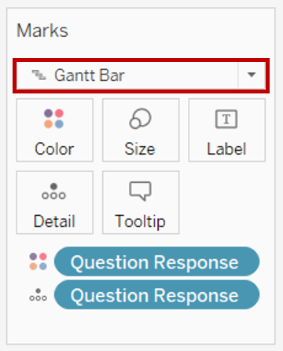

```{r setup, include=FALSE}
knitr::opts_chunk$set(echo = FALSE)
```

# 1.0  Critiques of Existing Visualisation with Suggested Improvements

```{r, echo=FALSE, message=FALSE}

knitr::include_graphics("images/Fig1_ExistingViz.png")
```

### Clarity

|S/N| Comments | Suggested Improvement |
|:-:| :------------------------------- | :------------------------------- |
| 1 | The order of the countries on the y-axis for both charts are not synchronised, making it difficult for the readers to match the corresponding country bars between the two charts. However, the use of sorting for the chart “% of strongly agreed to vaccination” makes it easier for readers to view the relative results across the countries. | Align the country order such that the values for each country are shown on the same row. Countries can be sorted in decreasing % of respondents who selected strongly agreed |
| 2 | The charts are showing the % of survey respondents who selected the respective response values. As the survey only polled a subset of the citizens within each country (i.e. sample) instead of all citizens (i.e. population), there would be some form of uncertainty associated with the values shown. However, the existing chart does not depict any uncertainty and readers might interpret the chart as showing the precise representation of the country’s true acceptance towards the vaccine. | Explore using statistical values to reflect the uncertainty associated with the survey results |
| 3 | The current chart title does not clearly describe the question being asked to capture the findings shown, which is only covering willingness to get the vaccine if available this week. Research also mainly utilised the survey data from interviews conducted in January 2021, but this timeframe was not shown in the data visualisation. | Revise the chart title to better represent the question asked as well as to reflect the timeframe of January 2021 within the data visualisation |
| 4 | Value labels for the left chart were kept to the original data labels which only indicated the textual label for rating 1 and rating 5 and keeping ratings 2 to 4 as the numeric label only. This might not be intuitive to the readers on what each number represents. | Recode the values to use textual labels instead (i.e. 1 as “Strongly agree”, 2 as “Agree”, 3 as “Neutral”, 4 as “Disagree” and 5 as “Strongly disagree”) |
| 5 | Scale of the x-axis of the two charts are not synchronised, causing the bars of the right chart to appear longer than the same value on the left chart. This might be misleading to the readers. | Synchronise the axis for all charts, particularly those that are side by side so that the scales of the charts are aligned |

### Aesthetics

|S/N| Comments | Suggested Improvement |
|:-:| :------------------------------- | :------------------------------- |
| 6 | Current position of the legend makes it difficult for the readers to match the value with its corresponding colour. Also, the title of the legend is showing the variable name instead of a related name to the chart and might confuse readers on whether the legend is meant for the left chart. | Legend should be shown near to the chart to allow easy matching of the values. Should legend title be required, it should be renamed to a related name to the chart |
| 7 | While the colour coding used for the chart on “Which country is more pro-vaccine” allows readers to distinctly identify the different categories, it does not depict the relativity of the labels that the finding is on a rating scale. | Revise the colour to show “Strongly agree” and “Agree” to use the same colour of different gradation. Likewise, “Strongly disagree” and “Disagree” will be shown with the same colour of different gradation as well |
| 8 | Coordinated use of blue colour for “Strongly agree” across the two charts allows for readers to better infer that the right chart might be showing a related value to the blue bar within the stacked chart of the left chart. | Coordinated use of colours can be adopted where applicable |
| 9 | Inconsistent x-axis labels across the two charts, where the x-axis labels for the left chart is shown as whole number while the right chart us shown to 1 decimal place | Standardise the number of decimal places across all the axis |
| 10 | Country labels are currently shown in full lowercase and with hyphens in the positions of the spaces. This might not be the best way to depict the country names. | Change the country names into proper case format and replace hyphens with space |


# 2.0  Ways to Improve Current Visualisation

### Sketch of Proposed Design

```{r, echo=FALSE, message=FALSE}

knitr::include_graphics("images/Fig2_Sketch.jpg")
```

-	Additional charts depicting data collected for other fields and the presence of on-demand parameters allow readers to deep dive further into the survey results, as well as to identify if there are any differences between the various segments instead of only comparing at the overall level.
-	Bar charts are kept to show the proportions of respondents within each country that have selected each of the response option. To further improve the ease of comparison, stacked bar charts are adopted that aligns the disagree vs agree.
- Error bars are added to show the uncertainty associated with survey data, and the range of findings at the various confidence levels. 


# 3.0  Step-by-step Description on Preparation

## 3.1 Data Source

Data used for this visualisation can be downloaded from [Imperial College London YouGov Covid 19 Behaviour Tracker Data Hub](https://github.com/YouGov-Data/covid-19-tracker). While the entire data hosted on Github contains survey results for 30 countries, only the datasets for the following 14 countries were used: Australia, Canada, Denmark, Finland, France, Germany, Italy, Japan, Netherlands, Norway, Singapore, South Korea, Sweden and United Kingdom.

## 3.2 Data Preparation

### Data Inspection of the Data Files for 14 Countries

- Inspecting the data showed that there are numerous other field columns that were not applicable for the research, as well as data rows that were out of the Jan 2021 timeframe of interest <br>
{width=100%}
- The codebook showed that all the datasets have the same variable fields (i.e. same header)
- There were some observed inconsistencies in the coding for some variables (e.g. 
)

### Concatenating Multiple Datasets in Tableau

- Launch Tableau. Under Connect to a File, click Text File <br>
{width=30%}
- Navigate to the file directory where the data is saved. Select the one of the country data files (e.g. australia)
-	Remove the Logical Table of Australia from the Data Source Selection pane <br>
{width=100%}
- Double click on New Union under the Files pane on the left <br>
{width=30%}
- In the popup “Union” window, drag in the datasets for all 14 countries from the left pane and click OK to merge rows from all datasets into one <br>
{width=50%}

### Filtering Master Data to Keep Relevant Data

- Click on Sheet 1 to add a new worksheet <br>
{width=40%}
- Drag the dimensions and measures for all the data fields of interest (Vac 1, Vac2_1, Vac2_2, Vac2_3, Vac2_6, Vac_3, Gender, Age, Household Size, Household Children, Employment Status) as well as country (i.e. Table Name) under the rows. For employment status, include all the relevant dimensions i.e. Employment Status, Employment Status 1, Employment Status 2 etc. <br>
{width=100%}

- Drag [RecordNo] under Detail of the All Marks Pane to keep the data at the individual respondent record level <br>
{width=30%}
- Drag endtime under Filters cart and select range of dates, then indicate 1 Jan 2021 12AM as the start date and 31 Jan 2021 11.59PM as the end date to only keep data in Jan 2021 <br>
{width=100%}
-	Click Analysis > View Data. In the popup “View Data” window, click the Export All button to save this filtered set of data as a new file (saved as consolidated_jan21 in this case) <br>
{width=80%}
- Close the current Tableau session

### Data Cleaning for Extracted Data in Tableau

- Launch a new Tableau session. Navigate to the directory on computer drive with the file “consolidated_jan2021” and drag the file into Tableau to connect the data  
- Click on Sheet 1 to add a new worksheet <br>
{width=40%}
-	Several new fields will be created to tidy up the existing data format. To create new field, click Analysis > Create Calculated Field. Rename the new field with text under "Field Name" column and input the formula under "Formula" column and click OK. Repeat this step for each of the new fields listed in the table below

|S/N| Field Name | Formula | Purpose |
|:-:| :----- | :-------------------------- | :--------------------- |
| 1 | Country | **REPLACE(REPLACE([Table Name], ".csv", ""), "-", " ")** | Remove the file extension and replace hyphens with space in the Table Name field which contains the country labels |
| 2 | Country Format | **TRIM(UPPER(LEFT(SPLIT([Country], " ", 1), 1)) + MID(SPLIT([Country], " ", 1), 2) + " " + UPPER(LEFT(SPLIT([Country], " ", 2), 1)) + MID(SPLIT([Country], " ", 2), 2))** | Proper case the country names i.e. capitalise the first letter of each word |
| 3 | Age Band | **IF [Age] <= 29 THEN "18 - 29" <br> ELSEIF [Age] <= 39 THEN "30 - 39" <br> ELSEIF [Age] <= 49 THEN "40 - 49" <br> ELSEIF [Age] <= 59 THEN "50 - 59" <br> ELSEIF [Age] <= 69 THEN "60 - 69" <br> ELSEIF [Age] > 69 THEN "70 and above" <br> END **| Create age bands for comparison |
| 4 | Household Size | **IF [Household Size] = 1 THEN "1 pax" <br> ELSEIF [Household Size] = 4 THEN "2 - 4 paxes" <br> ELSEIF [Household Size] <= 7 THEN "5 - 7 paxes" <br> ELSEIF [Household Size] = 8 THEN "8 or more paxes" <br> ELSEIF [Household Size] = 9 THEN "Don't know" <br> ELSEIF [Household Size] = 10 THEN "Prefer not to say" <br> ELSE "Not answered" END **| Create household size bands for comparison |
| 5 | Employment Status Format | **IF [Employment Status 1] = "Yes" THEN "Full time employment" <br> ELSEIF [Employment Status 2] = "Yes" THEN "Part time employment" <br> ELSEIF [Employment Status 3] = "Yes" THEN "Full time student" <br> ELSEIF [Employment Status 4] = "Yes" THEN "Retired" <br> ELSEIF [Employment Status 5] = "Yes" THEN "Unemployed" <br> ELSEIF [Employment Status 6] = "Yes" THEN "Not working" <br> ELSEIF [Employment Status 7] = "Yes" THEN "Other" <br> ELSE [Employment Status] END ** | Standardise format and recode all employment status into 1 consolidated field |

- As the data under the field of [Household Children] does not match with the codebook making it difficult to determine if the data captured are absolute quantitative responses or codes of qualitative responses, the field will not be used for subsequent visualisation steps

## 3.3 Creating Diverging Stacked Bar Chart

### Pivoting Data into Required Format

-	On Data Source tab, select the columns of the 6 data fields (Vac 1, Vac2_1, Vac2_2, Vac2_3, Vac2_6, Vac_3). Toggle to the top right of one of the selected column and click on the dropdown button. Select Pivot <br>
{width=60%} <br>

-	Scroll to the pivoted resulting columns. Rename [Pivot Field Names] to “Question Code” and [Pivot Field Values] to “Question Response”

### Creating the Required Fields

-	Click on Sheet 1 to add a new worksheet <br>
{width=40%} <br>

-	Toggle to the pill of [Question Response] under the left Data pane and click on the dropdown button to the right of the pill. Select Aliases <br>
{width=50%} <br>
Type the textual labels for the options under the “Value (Alias)” column and click OK. This helps to add proper text labels to the fields for display in the visulisation <br>
{width=60%} <br>
-	Several new calculated fields will be created for generating the diverging stacked bar chart. To create new field, click Analysis > Create Calculated Field. Rename the new field with text under "Field Name" column and input the formula under "Formula" column and click OK. Repeat this step for each of the new fields listed in the table below

|S/N| Field Name | Formula | Purpose |
|:-:| :-------- | :-------------------------- | :--------------------- |
| 1 | Number of Records | **1** | Create an artificial column on the count for ease of tabulation |
| 2 | Total Count | **TOTAL(SUM([Number of Records]))** | Create a total variable as the base |
| 3 | Count Negative | **IF [Question Response] = "5 – Strongly disagree" OR [Question Response] = "4" THEN 1 <br> ELSEIF [Question Response] = "3" THEN 0.5 <br> ELSE 0 END** | Calibrate the diverging scale |
| 4 | Total Count Negative | **TOTAL(SUM([Count Negative]))** | Create a total negative variable for generating starting point |
| 5 | Percentage | **SUM([Number of Records])/ [Total Count]** | Compute the percentages |
| 6 | Gantt Start | **-[Total Count Negative]/ [Total Count]** | Create a starting point for the gantt chart    |
| 7 | Gantt Percentage | **PREVIOUS_VALUE([Gantt Start]) + ZN(LOOKUP([Percentage], -1))** | Create the percent for the gantt chart |

### Generating the Chart

-	From the left Data pane, drag [Country Format] to Rows and [Gantt Percentage] under Columns <br>
{width=50%} <br>
-	Drag [Question Response] from the left Data pane to Detail under the Marks cart <br>
{width=50%} <br>
-	Toggle to [Gantt Percentage] under Columns and click on the dropdown button to the right of the pill. Select Compute Using > Question Response <br>
{width=50%} <br>
-	Drag [Question Response] from the left Data pane to Color under the Marks cart <br>
{width=50%} <br>
-	Under the Marks cart, click on the dropdown button and change the marks type to Gantt Bar <br>
{width=30%} <br>
-	Drag [Percentage] from the left Data pane to Size under the Marks cart <br>
{width=50%} <br>
-	Click on the dropdown button at the top right of the Legend of [Question Response] and select Sort. Under Sort By, select Manual from the list. Sort the labels using the arrows at the right into the order of Strongly disagree, Disagree, Neutral, Agree and Strongly agree <br>
{width=40%} <br>
-	Under the left Data pane, right-click [Question Code], and select Create > Set <br>
{width=50%} <br>
-	Under the popup “Create Set” window, check all options that should appear in the final filter card (i.e. Vac 1 and Vac 3). Rename the Set as Timeframe. Click OK <br>
{width=50%} <br>
-	Drag [Timeframe] to the Filter shelf <br>
{width=50%} <br>
-	Toggle to [Timeframe] under Filter shelf and click on the dropdown button to the right of the pill. Select Show Filter <br>
{width=30%} <br>
-	Click on the dropdown button at the top right of the Timeframe Filter. Select Single Value (list) <br>
{width=30%} <br>
-	Toggle to the pill of [Question Code] under the left Data pane and click on the dropdown button to the right of the pill. Select Aliases <br>
{width=50%} <br>
- Type the question labels for “Vac 1” as “This Week” and “Vac 3” as “A Year from Now” under the “Value (Alias)” column and click OK <br>
{width=50%} <br>
-	Click on the dropdown button at the top right of the Question Response Legend. Select Edit Colors. Change the colours of each category. The following colours were used for this dashboard: <br>
*Strongly disagree – #aa0000; Disagree – #f5715d; Neutral – #b3b7b8; Agree – #92c0df; Strongly agree – #4e79a7* <br>
{width=60%} <br>
- Click on the dropdown button at the top right of the Question Response Legend once more. Select Edit Title and change it to “Level of Agreement”
- Right click on the x-axis and select Add Reference Line
-	In the popup “Edit Reference Line, Band or Box” window, change the value to Constant and indicate 0. Change the label to None and make the preferred formatting for Line <br>
{width=50%} <br>
-	Right click on the x-axis again and untick Show Header to hide the x-axis
- Right click within the area of the chart and select Format. Click on the Lines button (fifth button on at the top). Under Rows tab, click on Grid Lines and format to own preference to show the horizontal lines. Under Columns tab, click None for Grid Lines <br>
{width=30%} <br>
-	Double click on the sheet title and amend it. The following title and formatting was used. Click OK <br>
{width=50%} <br>
- Right click on the Sheet 1 tab on the bottom bar and select Rename. Rename the sheet to "Diverging Chart"

### Creating a Dynamic Sorting Field

- In the left Data pane, click the dropdown button at the top right corner and select Create Parameter <br>
{width=30%} <br>
- In the popup “Create Parameter” window, rename the parameter as “Sort Descending by”. Select Integer under the Data type and select List under Allowable values. Under the List of values, input the exact response label under Value and the corresponding textual label of Strongly disagree, Disagree, Neutral, Agree and Strongly agree under Display as. Click OK <br>
{width=50%} <br>
- Toggle to the parameter pill of [Sort Descending by] under the left Data pane and click on the dropdown button to the right of the pill. Select Show Parameter <br>
{width=30%} <br>
- Click on the dropdown button at the top right of the Sort Descending by Parameter. Select Single Value (list)
- Several new calculated fields will be created for dynamic sorting. Click Analysis > Create Calculated Field. Rename the new field with text under "Field Name" column and input the formula under "Formula" column and click OK. Repeat this step for each of the new fields listed in the table below


|S/N| Field Name | Formula | Purpose |
|:-:| :-------- | :-------------------------- | :--------------------- |
| 1 | Response Value | **IF [Question Response] = "5 – Strongly disagree" THEN 5 <br> ELSEIF [Question Response] = "4" THEN 4 <br> ELSEIF [Question Response] = "3" THEN 3 <br> ELSEIF [Question Response] = "2" THEN 2 <br> ELSEIF [Question Response] = "1 - Strongly agree" THEN 1 END ** | Assign a numeric label for all responses for ease of computation |
| 2 | Percent Strongly Agree | **SUM(IF [Response Value] = 1 THEN 1 ELSE 0 END) / SUM([Number of Records])** | For counting number of respondents that selected Strongly Agree |
| 3 | Percent Agree | **SUM(IF [Response Value] <= 2 THEN 1 ELSE 0 END) / SUM([Number of Records])** | For counting number of respondents that selected Agree |
| 4 | Percent Neutral | **SUM(IF [Response Value] = 3 THEN 1 ELSE 0 END) / SUM([Number of Records])** | For counting number of respondents that selected Neutral |
| 5 | Percent Disagree | **SUM(IF [Response Value] >= 4 THEN 1 ELSE 0 END) / SUM([Number of Records])** | For counting number of respondents that selected Disagree |
| 6 | Percent Strongly Disagree | **SUM(IF [Response Value] = 5 THEN 1 ELSE 0 END) / SUM([Number of Records])** | For counting number of respondents that selected Strongly Disagree |
| 7 | Sort Order | **IF [Sort Descending by] = 1 THEN [Percent Strongly Agree] <br> ELSEIF [Sort Descending by] = 2 THEN [Percent Agree] <br> ELSEIF [Sort Descending by] = 4 THEN [Percent Disagree] <br> ELSEIF [Sort Descending by] = 5 THEN [Percent Strongly Disagree] <br> ELSE [Percent Neutral] END ** | To extract the relevant field based on selection in parameter |

- Toggle to [Country Format] under Rows and click on the dropdown button to the right of the pill. Select Sort. In the popup “Sort” window, select Nested under Sort By, Descending under Sort Order and Sort Order under Field Name. Keep Aggregation as Custom. Close the window <br>
{width=40%} <br>

### Customising the Tooltip

-	Click on the Add New Worksheet button to the right of “Diverging Chart” worksheet
-	From the left Data pane, drag [Question Response] to Rows and another [Question Response] under Columns <br>
{width=40%} <br>
-	Toggle to [Question Response] under Columns and click on the dropdown button to the right of the pill. Select Measure > Count <br>
{width=30%} <br>
-	Drag [Question Response] from the left Data pane to Color under the Marks cart
-	Drag [Number of Records] from the left Data pane to Label under the Marks cart. Toggle to [Number of Records] under Marks cart and click on the dropdown button to the right of the pill. Select Quick Table Calculation > Percent of Total. This is meant for the percentage label<br>
{width=40%} <br>
-	Drag another [Number of Records] from the left Data pane to Label under the Marks cart. This is meant for the count label <br>
{width=30%} <br>
-	Click on Label under the Marks cart then the button with 3 dots under Text. Format the label to own preference. In our case, the label was updated to **<% of Total SUM(Number of Records)> (<SUM(Number of Records)>)** and click OK <br>
{width=30%} <br>
-	Toggle to [Number of Records] under Marks cart and click on the dropdown button to the right of the pill. Select Format. Under Pane tab, change the Numbers under Default section to Percentage with 1 decimal place <br>
{width=40%} <br>
-	Toggle to [Question Response] under Rows and click on the dropdown button to the right of the pill. Select Sort. In the popup “Sort” window, select Manual under Sort By. Sort the labels using the arrows at the right into the order of Strongly Agree, Agree, Neutral, Disagree and Strongly disagree. Close the window <br>
{width=40%} <br>
-	Right click within the area of the chart and select Format. Click on the Lines button. Under Sheet tab, click on Grid Lines and select None
-	Right click on the x-axis and untick Show Header to hide the x-axis
-	Right click on the “Question Response” label just above the y-axis and select Hide Field Labels for Rows <br>
{width=30%} <br>
-	Right click on the Sheet 2 tab on the bottom bar and select Rename. Rename the sheet to “Tooltip”
-	Navigate back to the “Diverging Chart” worksheet
-	Click on Tooltip under the Marks cart. Edit the tooltip to keep the relevant content and amend the text where appropriate
-	Add the Tooltip chart by clicking on the Insert > Sheets > Tooltip. Amend the filter under the chart syntax in Tooltip from filter = “<All Fields>” to filter = “<Country Format>” <br>
{width=60%} <br>
-	Navigate back to the “Tooltip” worksheet and resize the chart by hovering along the bottom or right of the chart area until the resize arrow appears

## 3.4 Creating a Dot Plot with Error Bars

### Creating the Required Fields

-	Click on the Add New Worksheet button to the right of “Tooltip” worksheet
-	Several new calculated fields will be created for plotting the error bars. Click Analysis > Create Calculated Field. Rename the new field with text under "Field Name" column and input the formula under "Formula" column and click OK. Repeat this step for each of the new fields listed in the table below.  Some of the fields created earlier for the diverging chart will be reused

|S/N| Field Name | Formula | Purpose |
|:-:| :-------- | :-------------------------- | :--------------------- |
| 1 | Prop_SE | **SQRT(([Percent Strongly Agree]*(1-[Percent Strongly Agree]))/SUM([Number of Records]))** |  Compute the standard error proportion|
| 2 | Z_95% | **1.959964 ** | Z-value for 95% confidence interval (CI) |
| 3 | Z_99% | **2.575829** | Z-value for 99% CI |
| 4 | Prop_Margin of Error 95% | **[Z_95%]*[Prop_SE]** | Compute the margin of error for 95% CI |
| 5 | Prop_Margin of Error 99% | **[Z_99%]*[Prop_SE]** | Compute the margin of error for 99% CI |
| 6 | Prop_Lower Limit 95% | **[Percent Strongly Agree] - [Prop_Margin of Error 95%]** | Lower limit of 95% CI |
| 7 | Prop_Lower Limit 99% | **[Percent Strongly Agree] - [Prop_Margin of Error 99%]** | Lower limit of 99% CI |
| 8 | Prop_Upper Limit 95% | **[Percent Strongly Agree] + [Prop_Margin of Error 95%]** | Upper limit of 95% CI |
| 9 | Prop_Upper Limit 99% | **[Percent Strongly Agree] + [Prop_Margin of Error 99%]** | Upper limit of 99% CI |

### Generating the Chart

-	From the left Data pane, drag [Country Format] to Rows and [Percentage Strongly Agree] under Columns <br>
{width=30%} <br>
-	Drag [Measure Values] to Columns. Remove the unwanted measures and keep only Prop_Lower Limit 95%, Prop_Lower Limit 99%, Prop_Upper Limit 95% and Prop_Upper Limit 99% <br>
{width=20%} <br>
-	Toggle to [Measure Values] under Columns and click on the dropdown button to the right of the pill. Select Dual Axis <br>
{width=40%} <br>
-	Right click on the bottom x-axis and select Synchronise Axis
-	Click on the Measure Value Marks cart and change the Marks type to Line <br>
{width=30%} <br>
-	In the Measure Value Marks cart, remove [Measure Names] from Detail. Drag [Measure Names] from the left Data pane to Path and another to Color <br>
{width=30%} <br>
-	Click on the dropdown button at the top right of the Measure Names Legend. Select Edit Colors. Change the colours of each category. The following colours were used for this dashboard: <br>
* Prop_Lower Limit 95% and Prop_Upper Limit 95% – #76b7b2; Prop_Lower Limit 99% and Prop_Upper Limit 99%  – #afd6ed *
-	Reorganise the order of the dimensions under Columns to show the [Measure Values] before [Percent Strongly Agree] <br>
{width=30%} <br>
-	Click on the AGG(Percent Strongly Agree) Marks cart and change the Marks type to Circle. Click on colour to change it to the same colour as the Strongly Agree bar in the diverging stacked bar chart. Adjust the size of the dot to reduce it
-	Click on the dropdown button at the top right of the Measure Names Legend. Select Sort. In the popup “Sort” window, select Manual under Sort By. Sort the labels using the arrows at the right into the order below. Close the window <br>
{width=40%} <br>
-	Right click on the top x-axis and uncheck Show Header
-	Right click on the bottom x-axis and select Format. Under Axis tab, change the Numbers under Scale section to Percentage with 1 decimal place and Ticks to None <br>
{width=30%} <br>
-	Toggle to [Country Format] under Rows and click on the dropdown button to the right of the pill. Select Sort. In the popup “Sort” window, select Nested under Sort By, Descending under Sort Order and Sort Order under Field Name. Keep Aggregation as Custom. Close the window
-	Right click on the “Country Format” label just above the y-axis and select Hide Field Labels for Rows
-	Double click on the sheet title and amend it to “% Strongly Agree (95% and 99% Confidence Intervals)”. Click OK <br>
{width=40%} <br>
-	Toggle to [AGG(Percent Strongly Agree)] under Columns and click on the dropdown button to the right of the pill. Select Format. Under Pane tab, change the Numbers under Scale section to Percentage with 1 decimal place
-	Right click on the bottom x-axis and select Edit Axis. In the popup “Edit Axis” window, change the Axis Title to “% respondents”. Close the window <br>
{width=30%} <br>
-	Right click on the Sheet 3 tab on the bottom bar and select Rename. Rename the sheet to “Confidence Interval”

## 3.5 Adding Dynamic Parameters

- Navigate back to “Diverging Chart” worksheet
-	In the left Data pane, click the dropdown button at the top right corner and select Create Parameter
-	In the popup “Create Parameter” window, rename the parameter as “Segment Selection”. Select String under the Data type and select List under Allowable values. Under the List of values, input the list of contextual fields as below. Click OK <br>
{width=40%} <br>
-	Toggle to the parameter pill of [Segment Selection] under the left Data pane and click on the dropdown button to the right of the pill. Select Show Parameter
-	Click on the dropdown button at the top right of the Segment Selection Parameter. Select Single Value (list) <br>
{width=30%} <br>

-	Click Analysis > Create Calculated Field. Rename the new field as "Selected" and input the formula below then click OK <br>
**CASE [Segment Selection] <br>
WHEN "Overall" THEN  "" <br>
WHEN "Gender" THEN [Gender] <br>
WHEN "Age" THEN  [Age Band] <br>
WHEN "Household Size" THEN [Household Size Band] <br>
WHEN "Employment Status" THEN [Employment Status Format] <br>
END **
-	Drag [Selected] under Filter shelf. In the popup “Filter” window, tick the shown text and select All. Click OK
-	Toggle to [Selected] under Filter shelf and click on the dropdown button to the right of the pill. Select Show Filter
-	Click on the dropdown button at the top right of the Selected Filter. Select Single Value (list)

## 3.6 Creating Similar Charts for Other Fields

### Duplicating the Diverging Stacked Bar Chart

-	Duplicate the “Diverging Chart” worksheet
-	Remove Timeframe set from the Filters shelf
-	Under the left Data pane, right-click [Question Code], and select Create > Set
-	In the popup “Create Set” window, check all options that should appear in the final filter card (i.e. Vac 2_1, Vac 2_2, Vac 2_3 and Vac 2_6). Rename the Set as Other Findings. Click OK  <br>
{width=40%} <br>
-	Drag [Other Findings] to the Filter shelf
-	Toggle to [Other Findings] under Filter shelf and click on the dropdown button to the right of the pill. Select Show Filter
-	Click on the dropdown button at the top right of the Other Findings Filter. Select Single Value (dropdown)
-	Toggle to the pill of [Question Code] under the left Data pane and click on the dropdown button to the right of the pill. Select Aliases
-	Type the question phrasing for Vac 2_1, Vac 2_2, Vac 2_3 and Vac 2_6 under the “Value (Alias)” column and click OK

| Member | Value (Alias) |
| :--- | :---------------------- |
| Vac2_1 | I am worried about getting Covid-19 |
| Vac2_2 | I am worried about potential side effects of a Covid-19 vaccine |
| Vac2_3 | I believe government health authorities in my country will provide me with an effective Covid-19 vaccine |
| Vac2_6 | If I do not get a Covid-19 vaccine when it is available, I will regret it |

-	Double click the sheet title and reset it back to Sheet Name using the Insert button
-	Right click on the sheet tab on the bottom bar and select Rename. Rename the sheet to “Diverging - Oth”

### Duplicating the Dot Plot with Error Bars

-	Duplicate the “Confidence Interval” worksheet
-	Right click on the sheet tab on the bottom bar and select Rename. Rename the sheet to “CI - Oth”


# 4.0  Final Data Visualisation Output

```{r, echo=FALSE, message=FALSE, layout="l-body-outset"}


```

**Link to Tableau Dashboard:**


# 5.0  Major Observations


