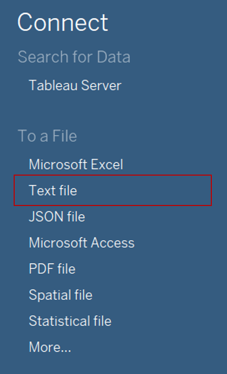
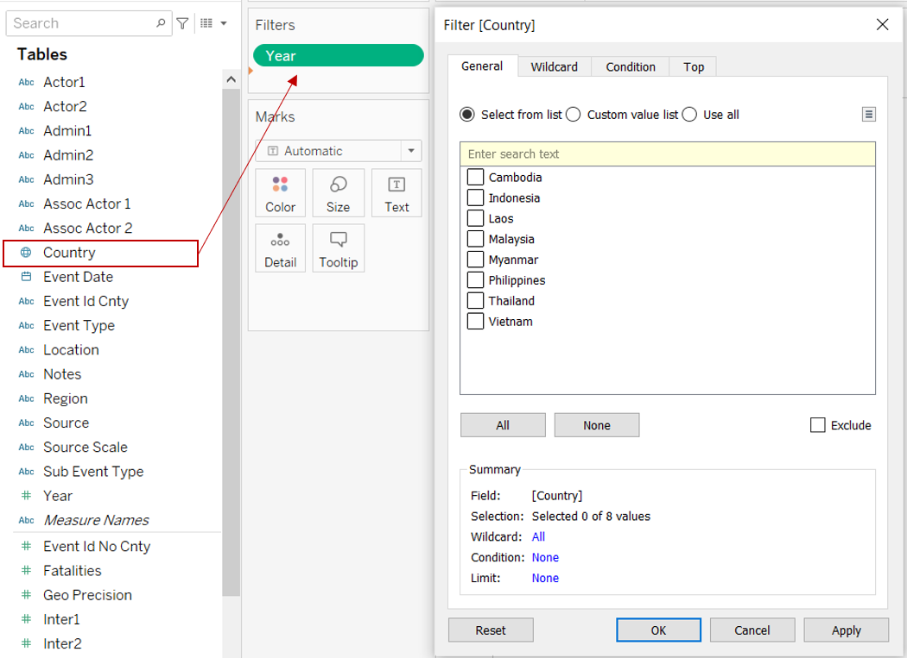
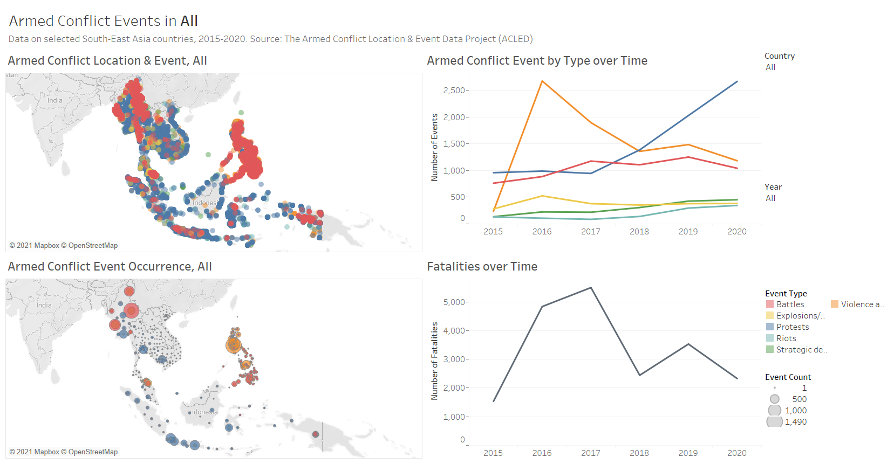

```{r setup, include=FALSE}
knitr::opts_chunk$set(echo = FALSE)
```

# 1.0  Critiques of Existing Visualisation with Suggested Improvements

```{r, echo=FALSE, message=FALSE}

knitr::include_graphics("images/Fig1_ExistingViz.png")
```

### Clarity

|S/N| Comments | Suggested Improvement |
|:-:| :------------------------------- | :------------------------------- |
| 1 | While the current map chart provides detailed information where each point represents each event, it is difficult for readers to compare the spatial data across the regions or countries especially when viewing at the “All” countries level. All the data symbols are cluttered and overlapping each other. | To allow for easier comparison of spatial patterns of armed conflicts, proportional symbol map can be adopted |
| 2 | Data used in the visualisation for 2020 ends at 31 October 2020 and hence is not complete with event data for November and December missing. Also, data for the Philippines only starts from January 2016 onwards. Readers might be misled by the current time period label of 2015 to 2020, without noticing the presence of the missing data points (i.e. events under-represent for 2020 and missing data for 2015 for the Philippines). | To download additional data from ACLED for 1 November to 31 December 2020 and provide a complete picture for 2020 events. Only data from 2016 onwards will be used in the visualisation to ensure data is available for the whole timeframe for all the countries shown |
| 3 | Each of the data symbol on the map chart is currently showing the spatial information of “Event Id Cnty”, “Latitude” and “Longitude” only in the tooltip. While the map allows readers to identify the country that the event has occurred, readers are not able to easily identify the specific location of the event from the latitude and longitude coordinates. “Event Id Cnty” might also confused readers who are not familiar with the dataset. | Include the province or district label (depending on the level of mapping used) in tooltip and replace “Event Id Cnty” with the country name instead |
| 4 | Each of the event types are being shown as separate line charts and the scale of the y-axis of these charts are not synchronised. Sequence of the charts also changes when filtering between countries. This makes it difficult for the readers to compare across the line charts by event type and by country. | Chart all the event types in one chart with each line represented by their corresponding colours used in the map chart |
| 5 | While there are existing labels for the y-axis of the line charts (Count of Sheet 1), they were not properly labelled to indicate what do the values of the lines represent exactly. | Revise the labelling of the axis to allow readers to clearly identify the data being charted (i.e. count of event occurrence) |

### Aesthetics

|S/N| Comments | Suggested Improvement |
|:-:| :------------------------------- | :------------------------------- |
| 6 | While tick marks are present for the y-axis of the time-series line charts, they are missing for the x-axis which is also on a continuous scale | Include tick marks for x-axis of the line charts |
| 7 | All of the data symbols are currently opaque, making it difficult for readers to identify the different points particularly overlapping ones. | Introduce transparency to the data symbols to allow readers to better view the overlaps (or the extent of overlaps when proportional symbol map is used) |
| 8 | Inconsistent y-axis labels across the line charts when viewing at the “All” countries level, where the chart for “Violence against civilians” showing the labels as thousands (e.g. 1K, 2K) where other charts were showing in full (e.g. 1000, 2000). Number format can also be improved for those showed in full. | Standardise the labelling format across the axis for all charts and include the comma at 1,000 mark if number format used is to show the number in full |
| 9 | Dynamic chart title for the map chart is useful to clearly show the readers the relevant country that was selected in the filter and shown in the chart | Keep this dynamic chart title to indicate the filtered parameters |

### Interactivity

|S/N| Comments | Suggested Improvement |
|:-:| :------------------------------- | :------------------------------- |
| 10 | Selecting data points on the line charts do not affect the visualisation within the map chart and vice versa, lacking the interactive filtering to only show the corresponding value on the other charts based on the reader’s selection within the chart | Set the line charts as one of the filter for the dashboard to allow dynamic changes in the map chart based on selection on the line chart |
| 11 | While there is a country filter to allow readers to select their country of interest, there is currently no parameter to allow filtering by year. For the map chart, all events from 2015 to 2020 are shown and readers cannot see the spatial patterns by years of interest | Add a filter by year to allow users to select the year of interest |
| 12 | Using tooltips allow readers to obtain more information on each data point that they toggled over, instead of cluttering the information within the visualisation. More information can be included in the tooltip | Include more detail information such as breakdown by sub-event type within the tooltip |
| 13 | Sorting is useful to expose patterns but the usage of sorting for the event types (i.e. sequence of line charts) might be confusing to readers since the variable that the sorting is based on might be unclear | If sorting is used, suggest to include a label on how sorting is done (i.e. variable used for sorting, ascending or descending) |


# 2.0  Ways to Improve Current Visualisation

### Sketch of Proposed Design

```{r, echo=FALSE, message=FALSE}


```

- Including dynamic filtering of years in addition to countries allow readers to compare the spatial patterns of armed conflicts in the selected countries over time.
- Using the line chart as filter allows for more dynamic interaction for the readers as they will be shown the corresponding data points on the map for the selected time and event type.
- Line charts are kept for depicting the occurrence of armed conflict events over time since line chart is one of the more appropriate chart types for time-series data. Likewise, map chart is kept for representing spatial data.
- Further breakdown of the temporal data by quarters and months will be shown to allow readers to compare for any seasonal changes across the year.

# 3.0  Step-by-step Description on Preparation

## 3.1 Data Source

Data used for this visualisation can be downloaded from [The Armed Conflict Location & Event Data Project (ACLED)](https://acleddata.com/data-export-tool/), focusing only on the South-east Asia dataset. While some of the South-east Asia countries have data starting from January 2010, only data from January 2016 onwards will be used as data for Philippines starts from 2016. Data is also available till date of download but only data up till 31 December 2020 (the last complete year) will be used.

## 3.2 Data Preparation

### Inspection of the Dataset

The dataset for South-east Asia has multiple fields, where each row represents a unique armed conflict event with multiple columns on different details of the event. The ACLED Codebook is reviewed and a data map is drawn out to show how the different variables are linked. Solid arrows in the data map represents a more granular level of data.

```{r, echo=FALSE, message=FALSE}


```

Exploring the dataset revealed the following:

-	South-east Asia countries covered include Cambodia, Indonesia, Laos, Malaysia, Myanmar, Philippines, Thailand and Vietnam. Three countries that were not included were Brunei, Timor-Leste and Singapore
- Dataset shared by Prof Kam only covers up till 31 October 2020
-	Data for Philippines only start from January 2016, unlike the other countries which have 2015 data
- There is a varying level of certainty of date and location across the events in the dataset

### Filtering Relevant Data from ACLED Dataset [Excel Worksheet]

Additional data was downloaded from ACLED website, which exports data in past 3 years interval regardless of timeframe specified. Comparing the two datasets – (1) shared by Prof Kam and (2) downloaded from ACLED – showed slight discrepancies in the number of data points for the overlapping time period. For consistency, data till 31 October 2020 will be based on Prof Kam’s dataset and data for November to December 2020 will be extracted from the ACLED dataset.

To extract the relevant time period from the ACLED dataset:

- Navigate to the file directory where the downloaded csv dataset is saved and open the file
- On the Home pane, click on the “Sort and Filter” function > Filter <br>
{width=100%}
- Under Column E [event_date], click on the dropdown button. Uncheck (Select All) and scroll down to select only 2020 > November and December. Months can be seen by clicking on the (+) button to the left of the year <br>
{width=50%}
- Copy the filtered data and paste it into another new excel worksheet
- Save the file as .csv file under the same file directory as Prof Kam’s dataset and name the file as “Southeast-Asia_Nov-Dec2020”

For ease of subsequent merging in Tableau, Prof Kam’s dataset will also be converted into csv file format.

### Concatenating the Two Datasets in Tableau [Tableau - Data Source]

- Launch Tableau. Under Connect to a File, click Text File <br>
{width=30%}
- Navigate to the file directory where the csv datasets are saved and double click on the “Southeast-Asia_2010-2020_Oct31” file
- Remove the Table of Southeast-Asia_2010-2020_Oct31 from the canvas <br>
{width=100%}
- Double click on New Union under the left pane <br>
{width=30%}
- In the popup “Union” dialog box, drag in the 2 datasets of Southeast-Asia_2010-2020_Oct31 and Southeast-Asia_Nov-Dec2020 and click Apply. This step will concatenate the two datasets into 1 master dataset <br>
{width=50%}

### Converting the Data Types [Tableau - Data Source]

- Click on the symbol at the top left of the header of field [EVENT_ID_NO _CNTY] and convert the data type of from Number (whole) to String <br>
{width=50%}
- Assign the respective geographical role to the fields indicated below by clicking on the symbol at the top left of the header of each field, select Geographic Role > the respective role to assign

| Field | Geographical Role |
| :--- | :------ |
| REGION | Country/Region |
| ADMIN1 | State/Province |
| ADMIN2 | County |
| ADMIN3 | City |
| LOCATION | City |

### Filtering to Keep the Relevant Rows [Tableau - Data Source]

-	Click Add in the Filters section in the upper-right corner of the data source page <br>
{width=50%}
-	In the popup “Edit Data Source Filters”dialog box, click Add to open an Add Filter dialog box listing all fields in the data source. Search for [EVENT_DATE] and select the field > specify Range of Dates in the popup “Filter Field” dialog box > Indicate 1/1/2016 as the start date and keep 31/12/2020 as the end date. Click OK <br>
{width=70%}


## 3.3 Creating Point Symbol Map (Armed Conflict Location & Event)

### Generating the Chart

- Click on Sheet 1 to add a new worksheet <br>
{width=40%}
- From the left Data pane, drag [LATITUDE] to Rows and [LONGITUDE] under Columns <br>
{width=40%}
- Drag [EVENT_ID_CNTY] and [EVENT_TYPE] from the left Data pane to Detail and Color under the Marks cart respectively <br>
{width=30%}
- Drag [YEAR] from left data pane to the Filters shelf. In the popup “Filter” dialog box, click on All and click OK <br>
{width=90%}
- Toggle to [YEAR] under Filter shelf and click on the dropdown button to the right of the pill. Select Show Filter <br>
{width=30%}
- Click on the dropdown button at the top right of the YEAR Filter. Select Single Value (list) <br>
{width=30%}
- Drag [COUNTRY] from the left Data pane to the Filters shelf. In the popup “Filter” dialog box, click OK <br>
{width=90%}
- Toggle to [COUNTRY] under Filter shelf and click on the dropdown button to the right of the pill. Select Show Filter
- Click on the dropdown button at the top right of the COUNTRY Filter. Select Single Value (list) <br>
{width=60%}
- Rename the title of the YEAR Filter to proper case by clicking on the dropdown button at the top right of the YEAR Filter and select Edit Title. Repeat for the COUNTRY Filter and the EVENT_TYPE Legend
- Click on the dropdown button at the top right of the Event Type Filter and select Edit Colors. In the popup “Edit Colors” dialog box, change the colors of each event type as below – Violence events in shades of red, yellow and orange; Demonstrations in shade of blue; Non-violent actions in shade of green <br>
{width=60%}
- Click on Color under the Marks cart and change the opacity to 50% to allow users to see overlapping points. Border was not added due to the large amount of overlaps <br>
{width=30%}
- Double click on the sheet title. In the popup "Edit Title" dialog box, amend the sheet title to “Armed Conflict Location & Event, <YEAR>” and click OK
- Right click on the Sheet 1 tab on the bottom bar and select Rename. Rename the sheet to “Point Map”

### Creating the Tooltip

-	On the “Point Map” sheet, drag [COUNTRY], [LOCATION], [SUB_EVENT_TYPE], [FATALITIES] and [EVENT_DATE] from the left Data pane to Tooltip under the Marks cart <br>
{width=35%}
-	Click on Tooltip under the Marks cart. Edit the tooltip according to the image below. Click OK <br>
{width=60%}
- Toggle to [ATTR(EVENT_DATE)] under Marks Cart and click on the dropdown button to the right of the pill. Select Format. Toggle to Pane tab. Under Default, change the Dates to “14 Mar 2001” <br>
{width=30%}

## 3.4 Creating Time-Series Line Chart (Armed Conflict Event by Type)

### Generating the Chart

- Click on the Add New Worksheet button to the right of “Point Map” worksheet to add a new worksheet <br>
{width=40%}
- From the left Data pane, drag [Union (Count)] to Rows and [EVENT_DATE] under Columns <br>
{width=40%}
- Drag [EVENT_TYPE] from the left Data pane to both Detail and Color under the Marks cart <br>
{width=30%}
- Right click on the y-axis and select Format. Within Axis tab, under Scale, change the Numbers to “Number (Standard)” and change the Ticks to a dark colour <br>
{width=50%}
- Right click on the y-axis and select Edit Axis. In the popup “Edit Axis” dialog box, change the Title under Axis Titles to “Number of Events”. Close the dialog box <br>
{width=55%}
- Right click on the y-axis label at the top “EVENT_DATE” and select Hide Field Labels for Columns <br>
{width=60%}
- Double click on the sheet title. In the popup "Edit Title" dialog box, amend the sheet title to “Armed Conflict Event by Type over Time” and click OK
- Right click on the Sheet 2 tab on the bottom bar and select Rename. Rename the sheet to “Events”

### Creating the Tooltip

- Click on the Add New Worksheet button to the right of “Events” worksheet to add a new worksheet
- From the left Data pane, drag [SUB_EVENT_TYPE] to Rows and [Union (Count)] under Columns <br>
{width=40%}
- Drag [Union (Count)] from the left Data pane to Label under the Marks cart
- Toggle to [CNT(Union)] under Marks cart and click on the dropdown button to the right of the pill. Select Quick Table Calculation > Percent of Total to create the percentage label <br>
{width=50%}
- Drag another [Union (Count)] from the left Data pane to Label under the Marks cart. This is meant for the count label <br>
{width=30%}
- Click on Label under the Marks cart then the button with 3 dots under Text. Update the label to <% of Total CNT(Union)> (<CNT(Union)>) and reduce the font size to 8pt then click OK <br>
{width=50%}
- Toggle to the [CNT(Union)] with Table Calculation under Marks cart and click on the dropdown button to the right of the pill. Select Format. Under Pane tab, change the Numbers under Default section to Percentage with 1 decimal place <br>
{width=50%}
- Click on Sort button to the right of the x-axis label to sort the bars in descending order <br>
{width=60%}
- Click on Color under the Marks cart and change the colour of the bars to grey <br>
{width=30%}
- Right click within the area of the chart and select Format. Click on the Lines button. Under Sheet tab, click on Grid Lines and select None <br>
{width=30%}
- Right click on the x-axis and untick Show Header to hide the x-axis
- Right click on the “SUB_EVENT_TYPE” label just above the y-axis and select Hide Field Labels for Rows
- Right click on the y-axis and select Format. Within the Header tab, change the Font to 8pt under Default
- Click on Size under the Marks cart and reduce the thickness of the bars <br>
{width=40%}
- Hover along the y-axis for the resize arrow to appear and adjust the position of the y-axis to show the full label for each bar
- Resize the chart size to a smaller area to fit into the tooltip by hovering along the bottom or right of the chart area until the resize arrow appears
- Right click on the Sheet 3 tab on the bottom bar and select Rename. Rename the sheet to “Tooltip Event”
- Navigate back to the “Time Series” worksheet
- Click on Tooltip under the Marks cart. Edit the tooltip according to preference. Add the Tooltip chart by clicking on the Insert > Sheets > Tooltip. Amend the dimensions of the chart in the given syntax. Below is the syntax used for the current tooltip shown <br>
{width=60%}

## 3.5 Creating Proportional Symbol Map (Armed Conflict Event Occurrence)

### Standardising the Mapping Level

-	Click on the Add New Worksheet button to the right of “Tooltip Event” worksheet to add a new worksheet
- Checking the number of counts for the different spatial variables showed that [ADMIN1] (corresponds to provincial level, or similar) is the lowest common mapping level available across all the data points <br>
{width=30%}
- From the left Data pane, drag [ADMIN1] into the chart canvas. Click on “236 unknown” message at the bottom right of the canvas. In the popup “Edit Locations” dialog box, click on the dropdown button for Country/Region and select From field > select COUNTRY <br>
{width=90%}
- 43 unknown provinces remained. Further investigation found that some of the province naming was not consistent with Tableau map data names (e.g. Indonesia provinces were spelled in Indonesia instead of the English names in the dataset) and others were at the same mapping level (e.g. Philippines captured regions under ADMIN1 and the province was given under ADMIN2)
- To address the mapping issue identified, a new calculated field will be created. Click Analysis > Create Calculated Field. Rename the new field as [Provincial Level] and input the formula below then click OK <br>
{width=70%}
- Clear the worksheet by clicking on the Clear Worksheet button <br>
{width=100%}

### Generating the Chart

- From the left Data pane, drag [Provincial Level] into the chart canvas. Click on unknown message at the bottom right of the canvas. In the popup “Edit Locations” dialog box, click on the dropdown button for Country/Region and select From field > select COUNTRY
- Within the same “Edit Locations” dialog box, under the State/Province tab, select the respective province names from the list under Matching Location for the remaining unknowns which is due to difference in naming <br>
{width=60%}
- From the left Data pane, drag [Union (Count)] and [EVENT_TYPE] to Size and Detail under the Marks cart respectively. Drag another [EVENT_TYPE] to Color <br>
{width=30%}
- Click on Size under the Marks cart and increase the size of the circles
- Click on Color under the Marks cart. Change the Opacity to 70% and click the dropdown button under Border to add a light grey border <br>
{width=30%}
- Click on Tooltip under the Marks cart. Edit the tooltip according to the image below <br>
{width=60%}
- Double click on the sheet title. In the popup "Edit Title" dialog box, amend the sheet title to “Armed Conflict Event Occurrence, <YEAR>” and click OK
- Right click on the Sheet 4 tab on the bottom bar and select Rename. Rename the sheet to “Proportional Map”


## 3.6 Creating Time Series Line Chart (Fatalities)

### Generating the Chart

- Click on the Add New Worksheet button to the right of “Proportional Map” worksheet to add a new worksheet
- From the left Data pane, drag [FATALITIES] to Rows and [EVENT_DATE] under Columns <br>
{width=40%}
- Click on Color under the Marks cart and change the colour of the line to grey <br>
{width=30%}
- Right click on the y-axis and select Format. Within Axis tab, under Scale, change the Numbers to “Number (Standard)” and change the Ticks to a dark colour 
- Right click on the y-axis and select Edit Axis. In the popup “Edit Axis” dialog box, change the Title under Axis Titles to “Number of Fatalities”.  Close the dialog box <br>
{width=55%}
- Right click on the y-axis label at the top “EVENT_DATE” and select Hide Field Labels for Columns
- Double click on the sheet title. In the popup "Edit Title" dialog box, amend the sheet title to “Fatalities over Time” and click OK
- Right click on the Sheet 5 tab on the bottom bar and select Rename. Rename the sheet to “Fatalities”

### Creating the Tooltip

- Click on the Add New Worksheet button to the right of “Fatalities” worksheet to add a new worksheet
- From the left Data pane, drag [EVENT_TYPE] to Rows and [FATALITIES] under Columns <br>
{width=40%}
- Drag [FATALITIES] from the left Data pane to Label under the Marks cart
- Toggle to [SUM(FATALITIES)] under Marks cart and click on the dropdown button to the right of the pill. Select Quick Table Calculation > Percent of Total to create the percentage label
- Drag another [FATALITIES] from the left Data pane to Label under the Marks cart. This is meant for the count label <br>
{width=30%}
- Click on Label under the Marks cart then the button with 3 dots under Text. Update the label to <% of Total SUM(FATALITIES)> (<SUM(FATALITIES)>) and reduce the font size to 8pt then click OK
- Toggle to the [SUM(FATALITIES)] with Table Calculation under Marks cart and click on the dropdown button to the right of the pill. Select Format. Under Pane tab, change the Numbers under Default section to Percentage with 1 decimal place
- Click on Sort button to the right of the x-axis label to sort the bars in descending order
- Drag [EVENT_TYPE] from the left Data pane to Color under the Marks cart <br>
{width=30%}
- Right click within the area of the chart and select Format. Click on the Lines button. Under Sheet tab, click on Grid Lines and select None
- Right click on the x-axis and untick Show Header to hide the x-axis
- Right click on the “EVENT_TYPE” label just above the y-axis and select Hide Field Labels for Rows
- Right click on the y-axis and select Format. Within the Header tab, change the Font to 8pt under Default
- Click on Size under the Marks cart and reduce the thickness of the bars
- Hover along the y-axis for the resize arrow to appear and adjust the position of the y-axis to show the full label for each bar
- Resize the chart size to a smaller area to fit into the tooltip by hovering along the bottom or right of the chart area until the resize arrow appears
- Right click on the Sheet 6 tab on the bottom bar and select Rename. Rename the sheet to “Tooltip Fatalities”
- Navigate back to the “Fatalities” worksheet
- Click on Tooltip under the Marks cart. Edit the tooltip according to preference. Add the Tooltip chart by clicking on the Insert > Sheets > Tooltip. Amend the dimensions of the chart in the given syntax. Below is the syntax used for the current tooltip shown <br>
{width=60%}

## 3.7 Dashboard

### Adding the Relevant Worksheets

- Click on the New Dashboard button on the bottom bar to create a new dashboard sheet <br>
{width=70%}
- In the left Dashboard pane, under Size, change it to Automatic <br>
{width=30%}
- From the left Dashboard pane, drag [Point Map] under Sheets onto the dashboard canvas then drag [Events] to the right of the [Point Map]. Drag [Proportional Map] and [Fatalities] to below [Point Map] and [Events] on the canvas <br>
{width=100%}

### Formatting

- Double click on one of the chart titles. Reduce the font size to 14pt and bold the title. Repeat for the other 3 charts
- Click on the [Country] filter and click the dropdown arrow on the left. Select Apply to Worksheets > All Using This Data Source. Repeat for the [Year] filter <br>
{width=40%}
- Click on the [Year] filter and click the dropdown arrow on the left. Select Apply to Worksheets > Selected Worksheets. In the popup “Apply Filter to Worksheets” dialog box, check only Proportional Map, Title, Tooltip Event and Tooltip Fatalities. Click OK <br>
{width=40%}
- Click on [Count of Union] Legend and click the dropdown arrow on the left. Select Edit Title. In the popup “Edit Legend Title” dialog box, change the title to “Event Count”
- Right click within the chart area of “Armed Conflict Event Occurrence” chart and select Clear Manual Sizing to resize the map and remove the scrollbar <br>
{width=60%}
- Toggle along the mid-line between the two columns of charts and shift the line to the right to expand the width of the map charts

### Adding a Dynamic Dashboard Title

- Click on the Add New Worksheet button to the right of “Dashboard 1” to add a new worksheet
- From the left Data pane, drag [COUNTRY] to Detail under the Marks cart <br>
{width=30%}
- Remove the [Longitude (generated)] and [Latitude (generated)] from Columns and Rows respectively
- Under the Marks cart, change the mark type to Polygon <br>
{width=30%}
- Double click on the sheet title. In the popup "Edit Title" dialog box, amend the sheet title to “Armed Conflict Events in **<COUNTRY>**” and click OK
- Right click on the Sheet 7 tab on the bottom bar and select Rename. Rename the sheet to “Title”
- Toggle back to “Dashboard 1”
- From the left Dashboard pane, drag [Title] under Sheets onto the top of the dashboard canvas
- Right click within the area of “Title” and select Fit > Entire View <br>
{width=50%}
- Resize the title area by hovering along the bottom of the text box until the resize arrow appears
- From the left Dashboard pane, drag Text under Objects to the top of the dashboard <br>
{width=30%}
- In the popup "Edit Text" dialog box, input the following description as the lead-in paragraph <br>
{width=50%}

### Uploading the Dashboard to Tableau Public
- At the bottom bar, select all worksheets by pressing shift and select on each worksheet. Right click and select Hide <br>
{width=80%}
- Toggle back to “Data Source”
- At the top right corner under Connection, convert the connection from Live to Extract to allow publishing to Tableau Public <br>
{width=30%}
- Toggle back to “Dashboard 1”
- Right click on the Dashboard 1 tab on the bottom bar and select Rename. Rename the sheet to “Dashboard”
- On the top navigation pane, click Server > Tableau Public > Save to Tableau Public As  <br>
{width=60%}
- In the popup “Tableau Public Sign In” dialog box, key in the relevant email and password to sign in
- In the popup “Save Workbook to Tableau Public” dialog box, give the workbook the relevant title and click Save
- The final workbook will be published onto Tableau Public


# 4.0  Final Data Visualisation Output

```{r, echo=FALSE, message=FALSE, layout="l-body-outset"}


```

**Link to Tableau Dashboard:** https://public.tableau.com/profile/selenechoong#!/vizhome/ISSS608DataVizMakeover3/Dashboard


# 5.0  Major Observations
